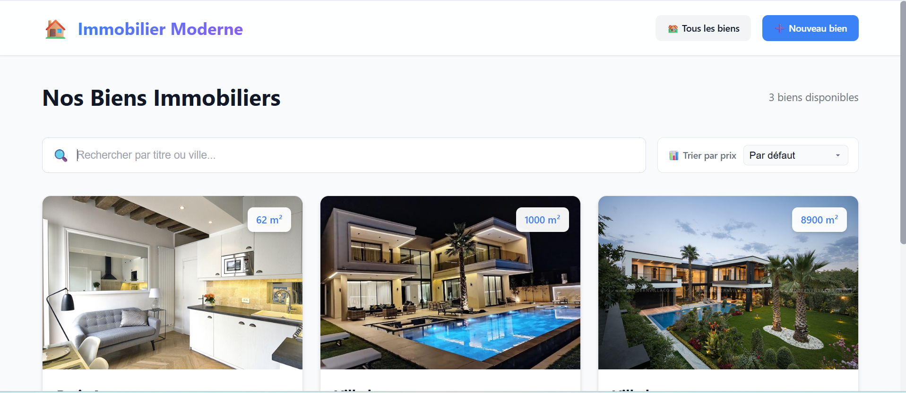
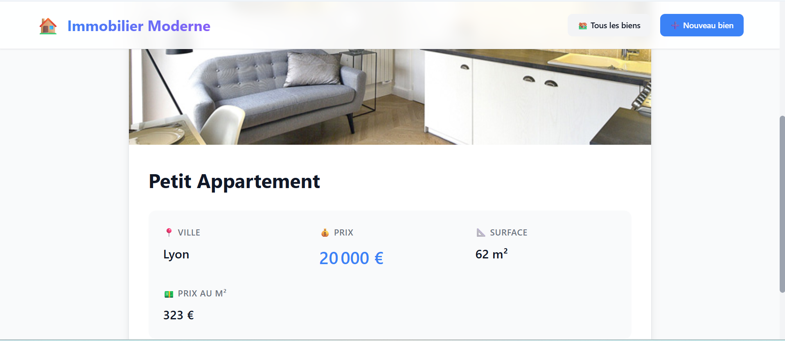
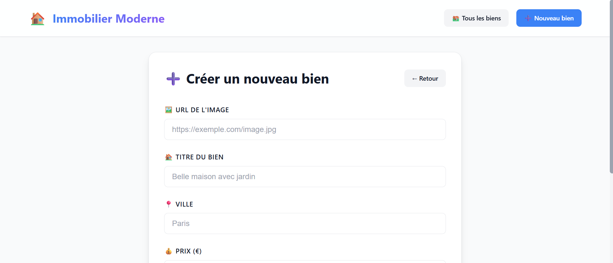

# 🏠 Mini Application Immobilière

Une application web moderne de gestion de biens immobiliers, développée avec React et Node.js/Express.

## 📋 Table des matières

- [Fonctionnalités](#-fonctionnalités)
- [Comment lancer le projet](#-comment-lancer-le-projet)
- [Architecture du projet](#-architecture-du-projet)
- [Choix techniques et justifications](#-choix-techniques-et-justifications)
- [Améliorations futures](#-améliorations-futures)

---

## ✨ Fonctionnalités

- 📋 Liste de tous les biens immobiliers
- 👁️ Consultation détaillée d'un bien
- ➕ Ajout de nouveaux biens
- ✏️ Modification des biens existants
- 🗑️ Suppression de biens
- 🎨 Interface moderne et responsive

---

## 📸 Aperçu de l'application

### Page d'accueil - Liste des biens immobiliers

*Vue d'ensemble de tous les biens disponibles avec leurs informations principales*

### Détails d'un bien

*Page de détail affichant toutes les informations d'un bien spécifique*

### Formulaire d'ajout/modification

*Interface pour créer ou modifier un bien immobilier*

---

## 🚀 Comment lancer le projet

### Prérequis

- **Node.js** (version 16 ou supérieure)
- **npm** ou **yarn**
- Un navigateur web moderne

### Installation et démarrage

#### 1️⃣ Cloner le projet

```bash
git clone https://github.com/salma-halloul/mini-app-immobiliere.git
cd mini-app-immobiliere
```

#### 2️⃣ Lancer le Backend

```bash
# Se déplacer dans le dossier backend
cd backend

# Installer les dépendances
npm install

# Démarrer le serveur (compilation + exécution)
npm start
```

Le serveur backend sera accessible sur **http://localhost:3000**

#### 3️⃣ Lancer le Frontend (dans un nouveau terminal)

```bash
# Se déplacer dans le dossier frontend (depuis la racine)
cd frontend

# Installer les dépendances
npm install

# Démarrer l'application en mode développement
npm run dev
```

L'application frontend sera accessible sur **http://localhost:5173**

#### 4️⃣ Accéder à l'application

Ouvrez votre navigateur et rendez-vous sur **http://localhost:5173**

---

## 🏗️ Architecture du projet

### Structure générale

```
mini-app-immobiliere/
├── backend/              # API REST avec Express et TypeScript
│   ├── src/
│   │   ├── models/      # Entités de données (Item)
│   │   ├── routes/      # Définition des routes API
│   │   ├── schemas/     # Validation avec Zod
│   │   ├── services/    # Logique métier
│   │   └── server.ts    # Point d'entrée du serveur
│   ├── package.json
│   └── tsconfig.json
│
└── frontend/            # Application React avec TypeScript
    ├── src/
    │   ├── components/  # Composants réutilisables (ItemCard, ItemForm)
    │   ├── pages/       # Pages (ItemList, ItemDetail, ItemEdit)
    │   ├── services/    # Communication avec l'API
    │   └── types/       # Types TypeScript
    ├── package.json
    └── vite.config.ts
```

### Architecture Backend (Express + TypeScript)

**Pattern : Architecture en couches (Layered Architecture)**

```
┌─────────────────────────────────────┐
│         Routes (API Layer)          │  ← Définition des endpoints
├─────────────────────────────────────┤
│       Schemas (Validation)          │  ← Validation avec Zod
├─────────────────────────────────────┤
│      Services (Business Logic)      │  ← Logique métier
├─────────────────────────────────────┤
│       Models (Data Entities)        │  ← Entités de données
└─────────────────────────────────────┘
```

- **Routes** (`item.routes.ts`) : Définit les endpoints REST (GET, POST, PUT, DELETE)
- **Schemas** (`item.schema.ts`) : Valide les données entrantes avec Zod
- **Services** (`item.service.ts`) : Contient la logique métier et gère les données en mémoire
- **Models** (`item.entity.ts`) : Définit la structure des entités (classe Item)

### Architecture Frontend (React + TypeScript)

**Pattern : Component-Based Architecture avec React Router**

```
┌─────────────────────────────────────┐
│          Pages (Views)              │  ← Routes principales
├─────────────────────────────────────┤
│      Components (UI Blocks)         │  ← Composants réutilisables
├─────────────────────────────────────┤
│       Services (API Calls)          │  ← Communication HTTP
├─────────────────────────────────────┤
│         Types (TypeScript)          │  ← Interfaces et types
└─────────────────────────────────────┘
```

- **Pages** : ItemList, ItemDetail, ItemEdit (gestion des routes)
- **Components** : ItemCard, ItemForm (composants réutilisables)
- **Services** : itemService.ts (gestion des appels API)
- **Types** : Définitions TypeScript partagées

---

## 💡 Choix techniques et justifications

### 1. **TypeScript (Backend + Frontend)**

**Pourquoi ?**
- ✅ **Typage statique** : Détection des erreurs à la compilation
- ✅ **Meilleure maintenabilité** : Code auto-documenté
- ✅ **Expérience développeur** : Autocomplétion et refactoring facilités
- ✅ **Cohérence** : Même langage côté client et serveur

### 2. **Express.js (Backend)**

**Pourquoi ?**
- ✅ **Simple et léger** : Framework minimaliste et performant
- ✅ **Flexible** : Grande liberté d'organisation du code
- ✅ **Écosystème riche** : Nombreux middlewares disponibles
- ✅ **Idéal pour des APIs REST** : Configuration rapide

### 3. **Zod (Validation)**

**Pourquoi ?**
- ✅ **Type-safe** : Génération automatique de types TypeScript
- ✅ **Validation robuste** : Messages d'erreur clairs
- ✅ **Syntaxe moderne** : API fluide et intuitive
- ✅ **Alternative moderne** : Plus léger que Joi ou Yup

### 4. **React + Vite (Frontend)**

**Pourquoi ?**
- ✅ **React** : Bibliothèque populaire avec grande communauté
- ✅ **Vite** : Démarrage ultra-rapide en développement (HMR instantané)
- ✅ **React Router** : Navigation SPA fluide
- ✅ **Composants réutilisables** : Architecture modulaire

### 5. **Architecture en couches**

**Pourquoi ?**
- ✅ **Séparation des responsabilités** : Chaque couche a un rôle précis
- ✅ **Testabilité** : Facile de tester chaque couche isolément
- ✅ **Évolutivité** : Facile d'ajouter des fonctionnalités
- ✅ **Maintenabilité** : Code organisé et structuré

### 6. **Stockage en mémoire**

**Pourquoi ?**
- ✅ **Simplicité** : Pas de configuration de base de données
- ✅ **Rapidité de développement** : Focus sur la logique applicative
- ✅ **Suffisant pour un MVP** : Adapté pour une démo ou un prototype

---

## 🚧 Améliorations futures

Si j'avais plus de temps, voici ce que j'ajouterais :

### 🗄️ Persistance des données

- **Base de données** : PostgreSQL ou MongoDB
- **ORM** : Prisma (PostgreSQL) ou Mongoose (MongoDB)
- **Avantages** : Données persistantes, requêtes optimisées, relations entre entités

### 🔐 Authentification et autorisation

- **JWT** : Authentification par tokens
- **Rôles utilisateurs** : Admin, Agent, Client
- **Protection des routes** : Middleware d'authentification
- **Gestion des sessions**

### 📸 Gestion avancée des images

- **Upload d'images** : Multer + Cloudinary/AWS S3
- **Galerie photos** : Multiple images par bien
- **Compression** : Optimisation automatique
- **Responsive images** : Plusieurs résolutions

### 🔍 Recherche et filtres avancés

- **Barre de recherche** : Recherche par titre, ville
- **Filtres** : Prix min/max, surface, type de bien
- **Tri** : surface, date d'ajout
- **Pagination** : Charger les résultats par lots

### 📱 Optimisations UX/UI

- **Toast notifications** : Feedback visuel des actions
- **Formulaires améliorés** : Validation en temps réel

### 🚀 Performance et scalabilité

- **Cache** : Redis pour les données fréquentes
- **Lazy loading** : Chargement différé des images
- **API pagination** : Limiter les données renvoyées
- **Rate limiting** : Protection contre les abus

### 📊 Fonctionnalités métier

- **Système de favoris** : Sauvegarder des biens
- **Comparateur de biens** : Comparer plusieurs propriétés
- **Alertes email** : Notifications nouveaux biens
- **Tableau de bord** : Statistiques pour les admins
- **Système de réservation** : Prendre rendez-vous pour visites

### 🛠️ DevOps et monitoring

- **Docker** : Conteneurisation de l'application

### 🌐 Internationalisation

- **i18n** : Support multilingue (FR, EN, ES)
- **Formats localisés** : Devises, dates, nombres

---


## 👨‍💻 Auteur

**Salma Halloul**
- GitHub: [@salma-halloul](https://github.com/salma-halloul)